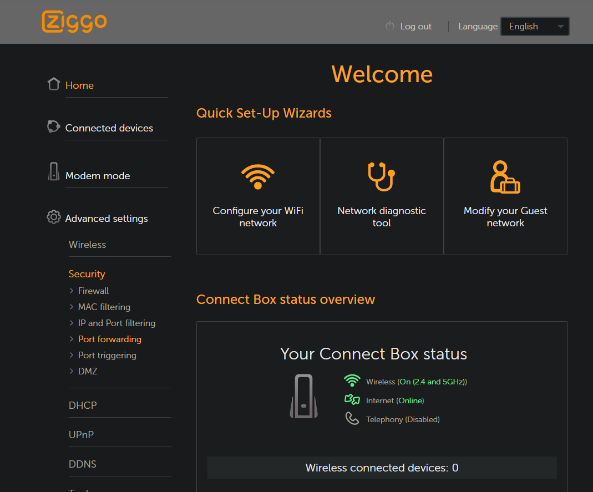
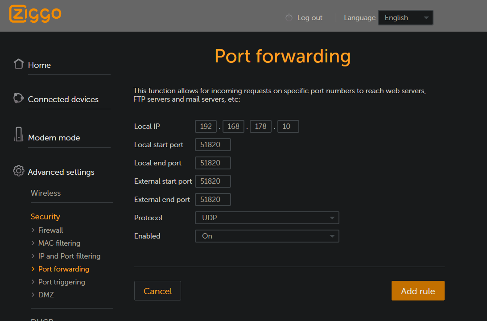

# Wireguard VPN
Super easy to use VPN server in a docker container

## Clients
Full list can be found [here](https://www.wireguard.com/install/): 

https://www.wireguard.com/install/

Clients:

[Macos (app store)](https://itunes.apple.com/us/app/wireguard/id1451685025?ls=1&mt=12)

[iOS (app store)](https://itunes.apple.com/us/app/wireguard/id1441195209?ls=1&mt=8)

[Windows Installer](https://download.wireguard.com/windows-client/wireguard-installer.exe)

## Before deployment
### Dynamic DNS
Link a uri to you public ip

Popular dns providers are [duckdns](https://www.duckdns.org/) and [freedns](https://freedns.afraid.org/) 
They let you link you ip to a domain name of them. eg. https://ozsddnsadres.duckdns.org/
This will let you route traffic back home.
To find your public IP (you must be on your home network and) simply google ['What is my IP'](https://www.google.nl/search?q=what+is+my+ip)

_After you have created an account and requested a subdomain,_ Enter the ip you googled before in the subdomain settings. 

__don't forget to update the created subdomain in de docker-compose.yml file__

### Port Forwarding
Go to your router's home page

For Ziggo: http://192.168.178.1/

Go to Advanced Settings -> Security -> Port Forwarding



Press 
> Create New Rule

Add your IP 
> 192.168.178.20

Enter port "51820" 4 times

Choose "UDP" protocol

And set to enabled 

> Add Rule

> Apply Changes




## Deploying Container with portainer
Browse to your pi's IP on port '9000' to go to portainer 'http://<ip_address_pi>:9000'

```
http://192.168.178.20:9000
```
Press 'local' 


In the right taskbar, press:

> stacks

> new stack

Enter name 'wireguardvpn' _(no capitols or characters)_

Copy/paste docker-compose.yml
> deploy stack

This could take a minute. A green (or red) notification will appear in the right upper corner of the screen when it is finished.

If it was green, all went well.

To access the wireguard admin page, go to 'http://<ip_address_pi>:51821'
```
http://192.168.178.20:51821 
```
You're mqtt broker has the same ip as the pi and uses the normal port for mqtt, __1883__

If the notification after deployment was red however, something went wrong. 
Probably a faulty indentation when copy/pasting.

Solutions?
- Google
- Call Kano

# docker-compose.yml
## Deploy with docker-compose
### To start / stop
```
docker-compose up -d
docker-compose down

```
> -d for detached. Curious? Try without
version: "2"
services:
  wg-easy:
    environment:
      # ⚠️ Required:
      # Change this to your host's public address
      - WG_HOST=ozsddnsadres.chickenkiller.com

      # Optional:
      # - PASSWORD=foobar123
      # - WG_PORT=51820
      # - WG_DEFAULT_ADDRESS=10.8.0.x
      # - WG_DEFAULT_DNS=1.1.1.1
      - WG_ALLOWED_IPS=0.0.0.0/0, ::0
      
    image: weejewel/wg-easy
    container_name: wg-easy
    volumes:
      - /home/pi/docker/wg-easy:/etc/wireguard
    ports:
      - "51820:51820/udp"
      - "51821:51821/tcp"
    restart: unless-stopped
    cap_add:
      - NET_ADMIN
      - SYS_MODULE
    sysctls:
      - net.ipv4.ip_forward=1
      - net.ipv4.conf.all.src_valid_mark=1
    extra_hosts:
      - "host.docker.internal:host-gateway"
```

## To Change
### Mandatory
- WG_HOST: to your ddns address (see above: Dynamic dns)

### Optional
- ports: you can change the port of the webpage '51821' to an easier to remember number like "12345:51821". Only change the host port ("host_port:container_port"). HOWEVER, __NEVER__ change the wireguard port '51820' unless you feel confident you know what you are doing.
- volumes: you can change the host folder mapping, tho it should be fine if you follow the README.md's

# More info
https://github.com/WeeJeWel/wg-easy/
